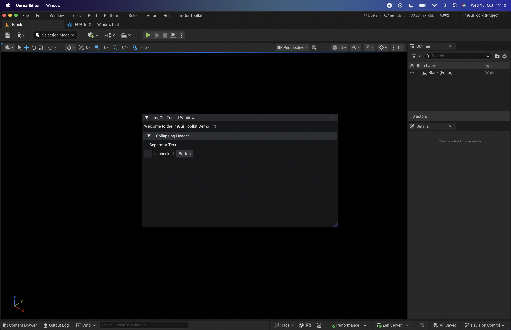

# ImGui Toolkit

A blueprint-friendly Dear ImGui integration for Unreal Engine.

⚠️ This plugin is still very early in development.

⚠️ This is the "project-version", it comes with an Unreal Engine 5.7.0 project and a few examples how to use the ImGuiToolkit plugin.

The goal of ImGuiToolkit is to make creating Dear ImGui interfaces for runtime debugging and editor tools in Unreal Engine as simple as possible.
It provides seamless integration between Unreal and Dear ImGui through easily bindable delegates in both C++ and Blueprint, and it automatically handles common type conversions for you (for example: FText ↔ const char*, FLinearColor ↔ ImVec4, and so on).

ℹ️ Note: ImGuiToolkit gives you full access to Dear ImGui’s capabilities in C++. In Blueprints, it offers a streamlined subset designed to help you build UIs faster and with fewer necessary decisions.

🧩 **Attribution:** ImGuiToolkit builds upon and includes code from the following open-source projects:

- [**Dear ImGui (1.91.8)**](https://github.com/ocornut/imgui) by **ocornut**
- [**ImGui Unreal Engine Plugin**](https://github.com/VesCodes/ImGui) by **VesCodes**
- [**ImPlot**](https://github.com/epezent/implot) by **epezent**
- [**NetImgui**](https://github.com/sammyfreg/netImgui) by **sammyfreg**

## Example of ImGui Toolkit in Action

## Status Quo

### Containers

- [x] Window
- [x] Collapsing Header
- [x] TabBar
- [x] Tree
- [x] Menu Bar

### Layout

- [x] Align Text To Frame Padding
- [x] Dummy
- [x] Indent / Unindent
- [x] New Line
- [x] Same Line
- [x] Separator
- [x] Spacing

### Text

- [x] Text
- [x] Bullet Text
- [x] Label Text
- [x] Separator Text
- [x] Text Colored
- [x] Text Disabled
- [x] Text Wrapped
- [x] Text Link Open URL

### Main

- [x] Arrow Button
- [x] Checkbox
- [x] Button
- [x] Radio Button Group
- [x] Small Button
- [x] Combo Box
- [x] Progress Bar
- [x] Bullet
- [x] Set Item Tooltip
- [ ] Begin/End Tooltip
- [ ] Popup
- [x] Table
- [x] Help Marker

### Images

- [ ] Image
- [ ] Image Button

### Sliders

- [x] Drag Float
- [x] Drag Int
- [x] Slider Float
- [x] Slider Int

### Input with Keyboard

- [x] Input Text
- [x] Input Text Multiline
- [x] Input Float
- [x] Input Int

### Color Editor/Pickers

- [x] Color Edit
- [x] Color Picker
- [x] Color Button

### Selectables

- [x] Selectable
- [ ] Multi Selectable

### Settings / Backend

- [x] Plugin settings
- [x] Runtime and editor-hosted style settings
- [x] Docking support
- [x] ImPlot backend context support
- [x] NetImgui backend integration

## Other TODOs

- [x] ImGui windows should not always be rendered on top of Slate windows
- [x] ImGui windows behind slate windows should not "steal" input
- [x] Get copy+paste to work for InputText / InputTextMultiline
- [x] Finish the ImGui Host EditorUtility Widget visibility behavior
- [ ] Create useful real-world examples (one runtime and one editor tool)
- [ ] Add Blueprint-friendly ImPlot wrappers and an example
- [x] Add Blueprint-friendly table wrappers
- [x] Add Blueprint-friendly color editor/picker wrappers
